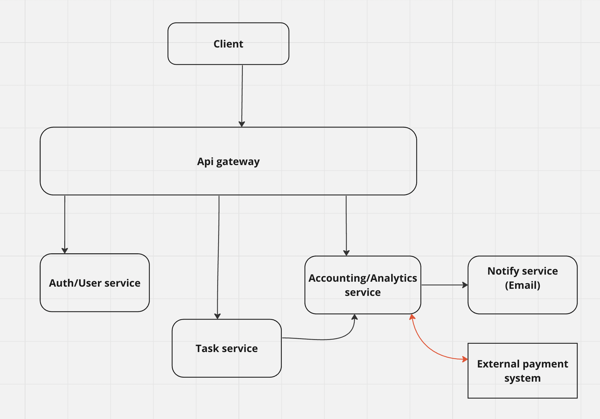

# AA course - Home work 0

## Intro
All interactions are syncronous except interaction between Accounting service and "External payment system"

There may be a situation in which the banking system may be very heavily loaded and the money transfer operation will take a long time to complete. That's why i decided to make this interaction async.

### Auth/User service
In a large system it can be three services but for the sake of simplicity it is a one service responsible for authentication, authorization, CRUD user operations.

### Task service
It is just domain service responsible for task management

### Accounting/Analytics service
I think it should be noted that it stores immutable and calculated data needed for billing and analytics. Perhaps this will help later in the design.

At the end of each day cron job should be executed. It starts the payment
